# E-Library


**E-Library** is a high-performance, immersive Digital Library mobile application built entirely with **Flutter** and **SQLite**. Designed to provide a comprehensive library management ecosystem, E-Library allows you to seamlessly borrow books, read PDFs, and automatically manage fines based on a Role-Based Access Control (RBAC) system.

---

## Features

- **Role-Based Authentication**: Supports 3 access levels:
  - **Administrator**: Has full control over the system, including adding or removing Librarians and Students.
  - **Librarian**: Manages the book catalog (CRUD) and monitors the entire book borrowing history.
  - **Student**: Can search for books, borrow books, read books, and view their fine history.
- **Integrated PDF Reader**: Read PDF book files directly within the application. Equipped with an automatic bookmark memory, allowing users to resume reading from the last opened page.
- **Automated Fine System**: Intelligently calculates the borrowing duration and delays, automatically accumulating fines if the return deadline is exceeded.
- **Offline-First (SQLite)**: All user data, books, and borrowing histories are stored locally on the device without requiring an internet connection.
- **Modern Immersive UI & Dark Mode**: Built with Material 3 design principles, featuring an immersive fullscreen layout by default and fully integrated Dark Mode.
- **Multilingual Support**: Automatically adapts to device language settings (Supports English and Indonesian).
- **Debounced Search**: A highly optimized book search feature (500ms debounce) to prevent UI lag on devices when typing book titles rapidly.
- **Automated CI/CD Pipeline**: Fully configured with GitHub Actions to automatically build, protect (Obfuscate/R8), sign, and attach APK releases.

---

## Getting Started

### Prerequisites
- [Flutter SDK](https://docs.flutter.dev/get-started/install) (latest stable version recommended)
- A connected device or emulator (Android recommended)

### Installation
1. Clone the repository:
   ```bash
   git clone https://github.com/AkaneKanzaki/E-Library.git
   ```
2. Navigate to the project directory:
   ```bash
   cd E-Library
   ```
3. Get the dependencies:
   ```bash
   flutter pub get
   ```
4. Run the app:
   ```bash
   flutter run
   ```

### Default Accounts (Dummy Data)
- **Administrator**: `admin@library.com` / `admin123`
- **Librarian**: `librarian@library.com` / `librarian123`
- **Student**: Register a new account via the app.

---

## Tech Stack & Architecture

- **Framework**: Flutter / Dart
- **State Management**: `Provider` (ChangeNotifier based architecture)
- **Database**: `sqflite` (Offline-First Local Storage)
- **Key Libraries**: `shared_preferences`, `flutter_pdfview`, `package_info_plus`
- **CI/CD**: GitHub Actions (Automated APK Build & Release)

---

## Screenshots

### Core Interface
| Splash Screen | Dashboard (Student) |
| --- | --- |
| 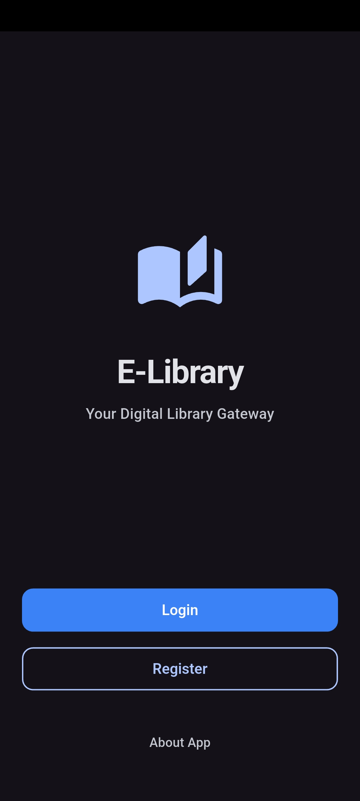 | 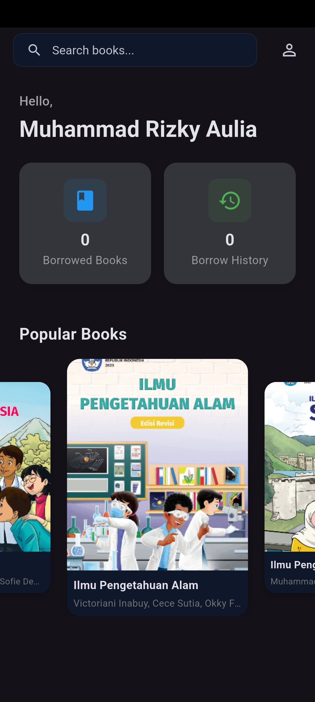 |

| Dashboard (Admin) | Dashboard (Librarian) |
| --- | --- |
| 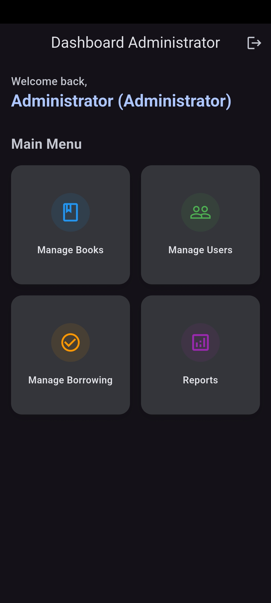 | 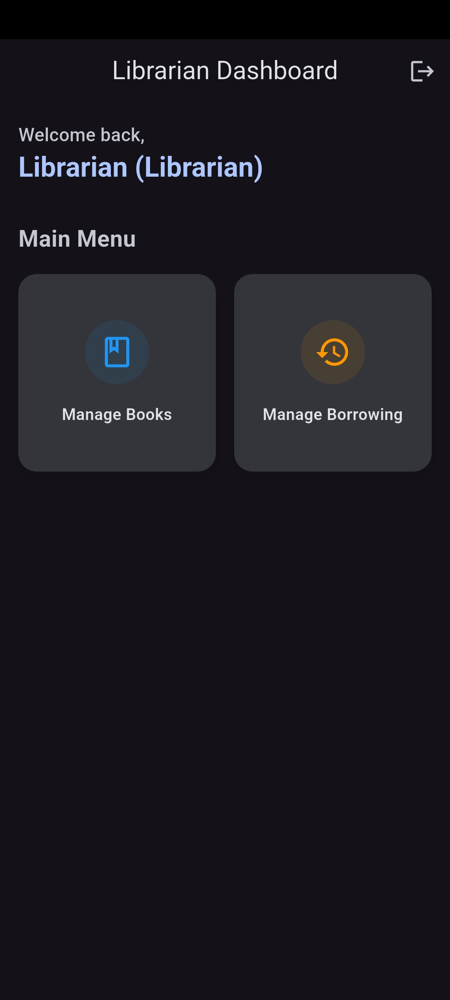 |

### Books & Borrowing (Student)
| Book Details | Borrowed Books | Borrowing History |
| --- | --- | --- |
| 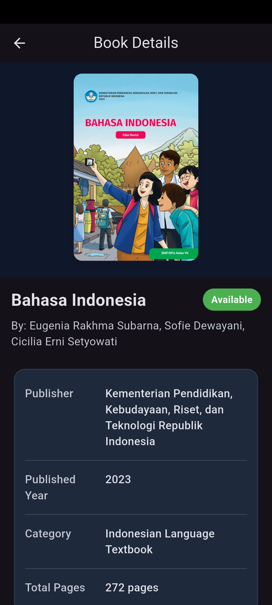 | 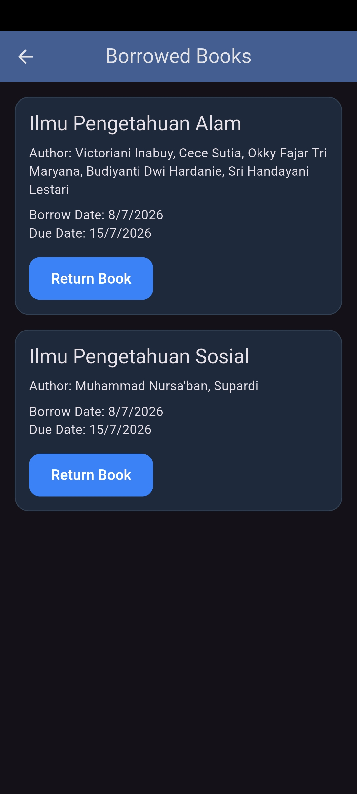 | 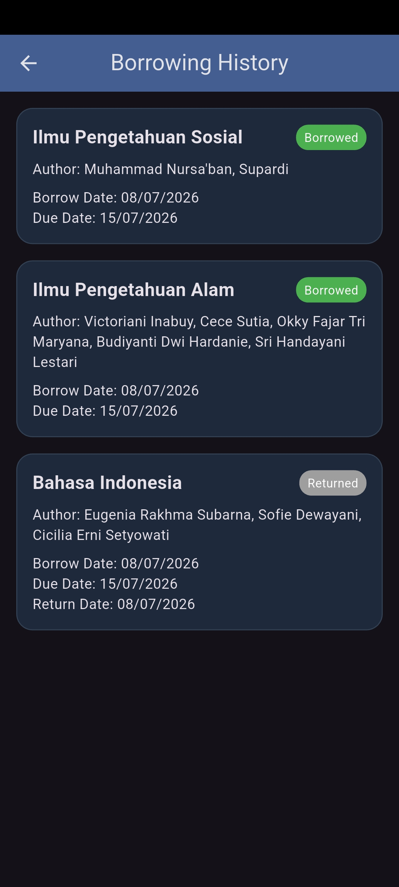 |

### Management & Reports (Admin/Librarian)
| Manage Books | Manage Users |
| --- | --- |
| 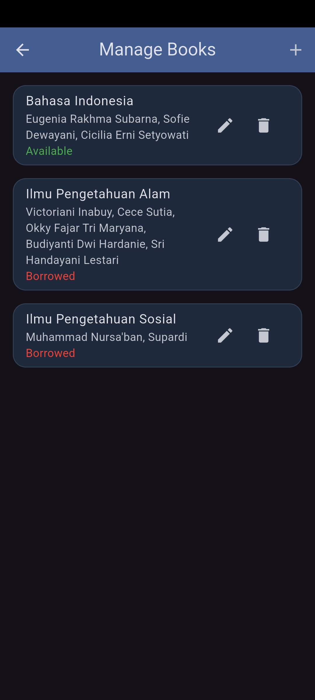 | 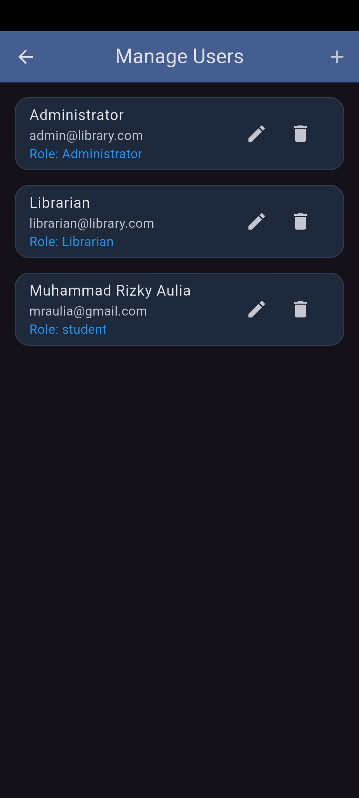 |

| Borrowing List | Reports |
| --- | --- |
| 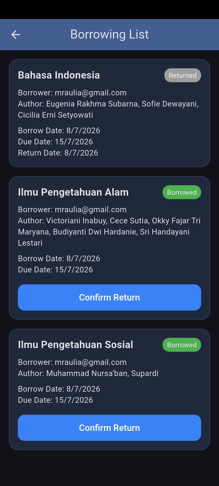 | 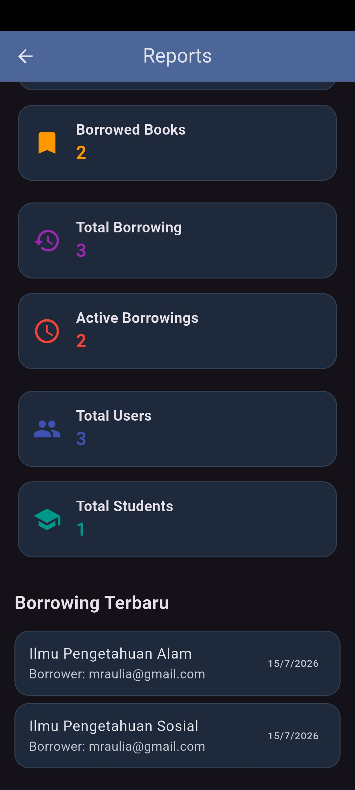 |

### Authentication & Settings
| Login | Register | Profile & Settings |
| --- | --- | --- |
| 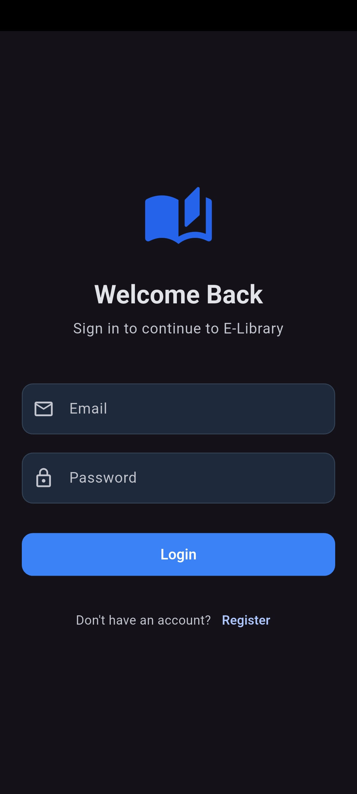 | 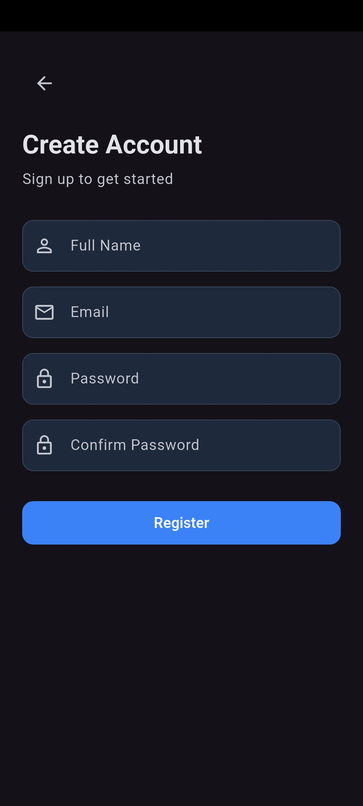 | 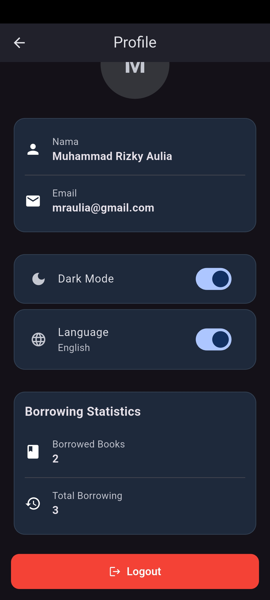 |

### Miscellaneous
**About App**
<br>
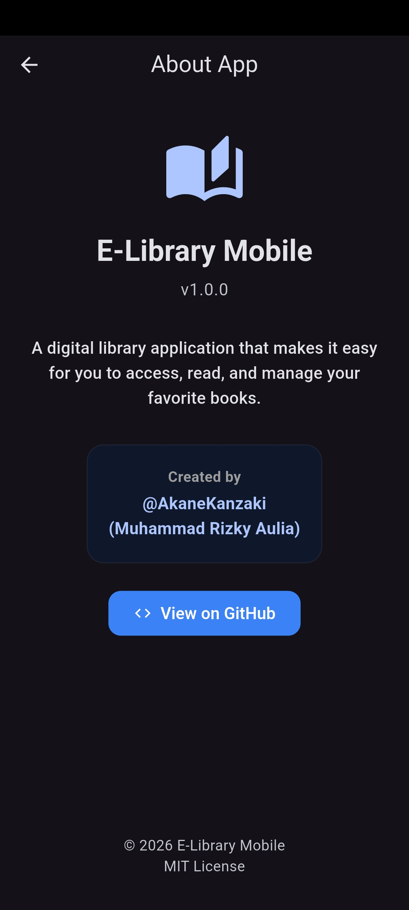

---

## Contributing

Contributions, issues, and feature requests are welcome! 
Feel free to check [issues page](https://github.com/AkaneKanzaki/E-Library/issues) if you want to contribute.

---

## License

This project is licensed under the MIT License - see the [LICENSE](LICENSE) file for details.
